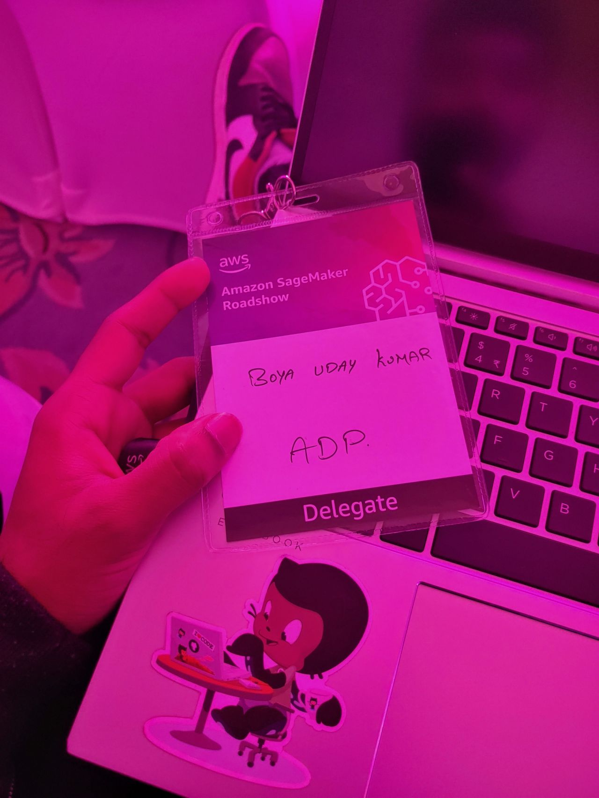
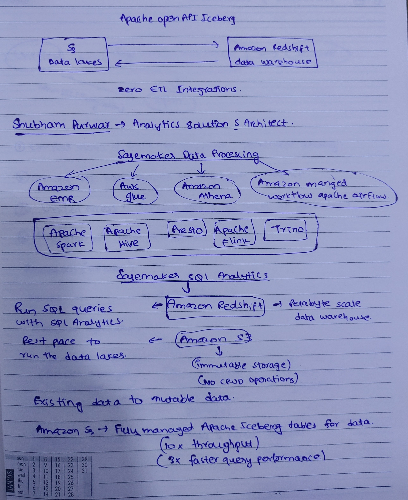
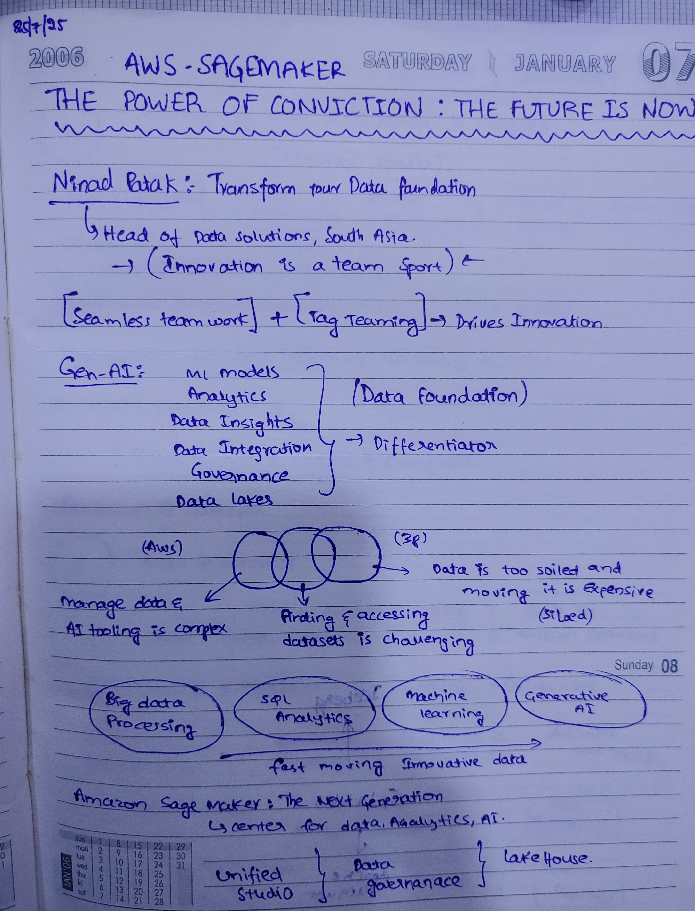
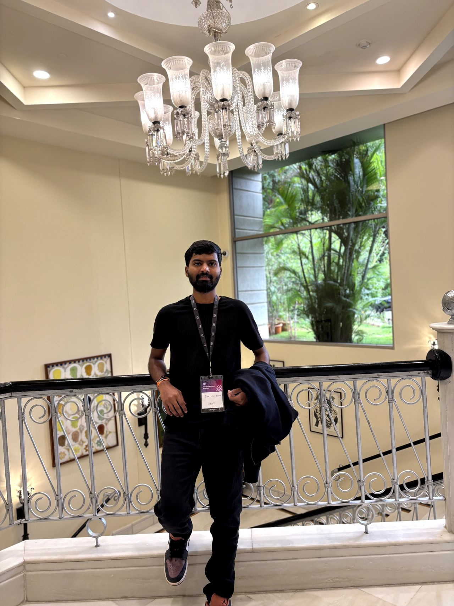
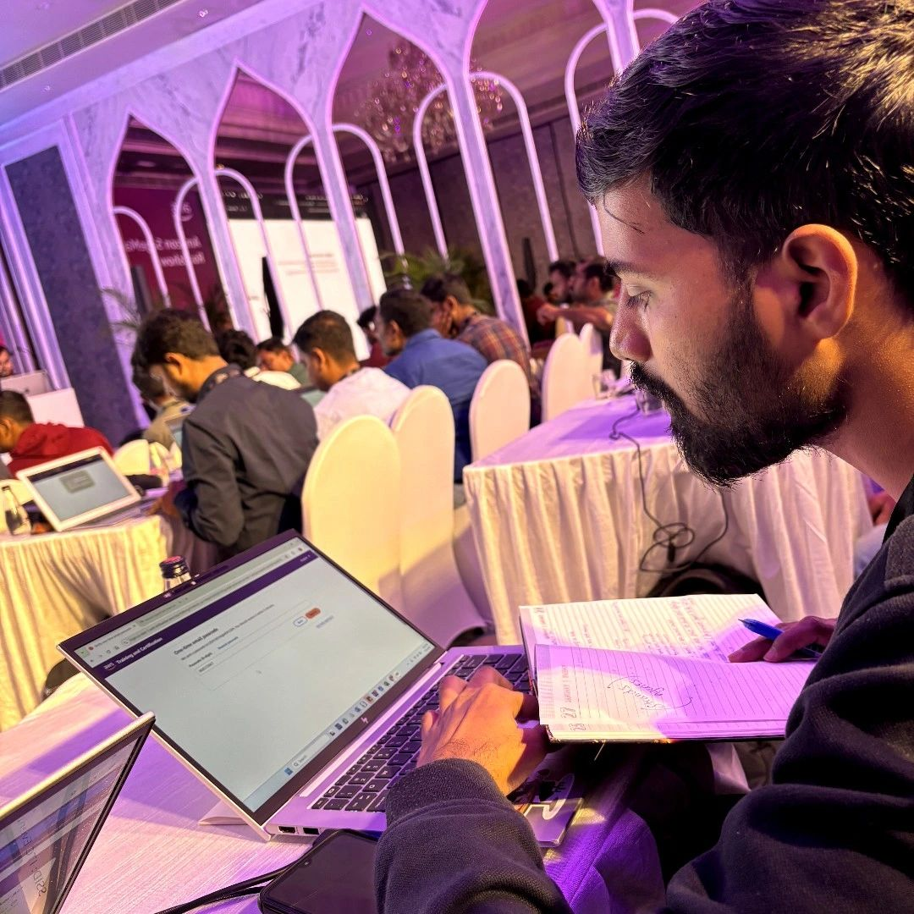
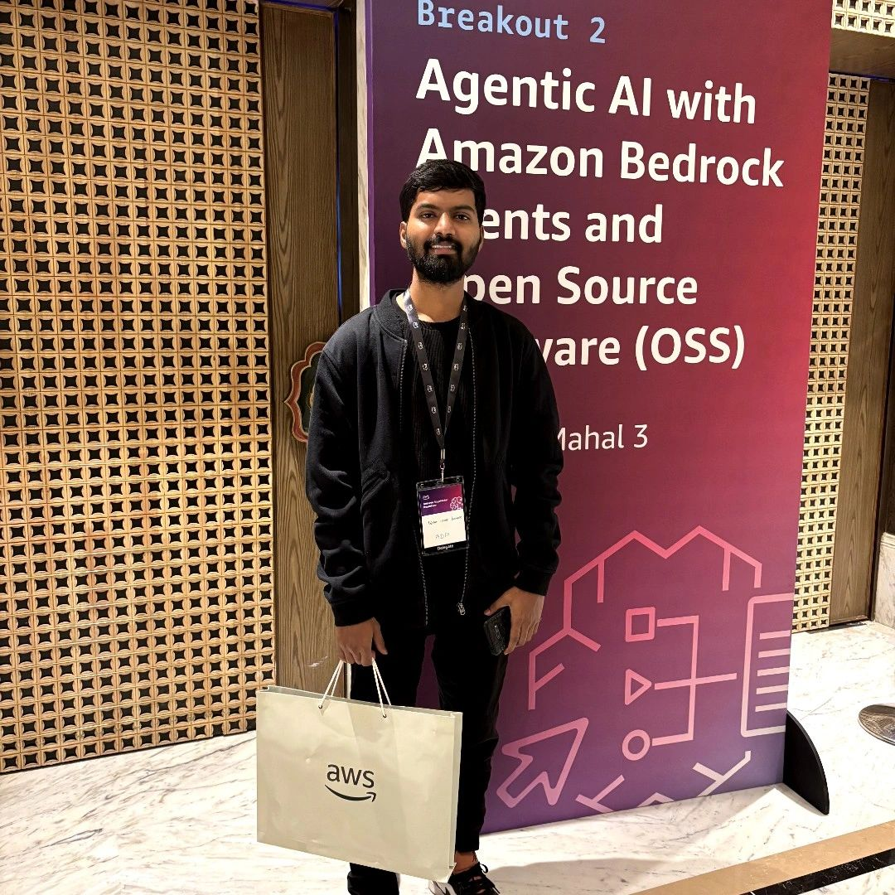
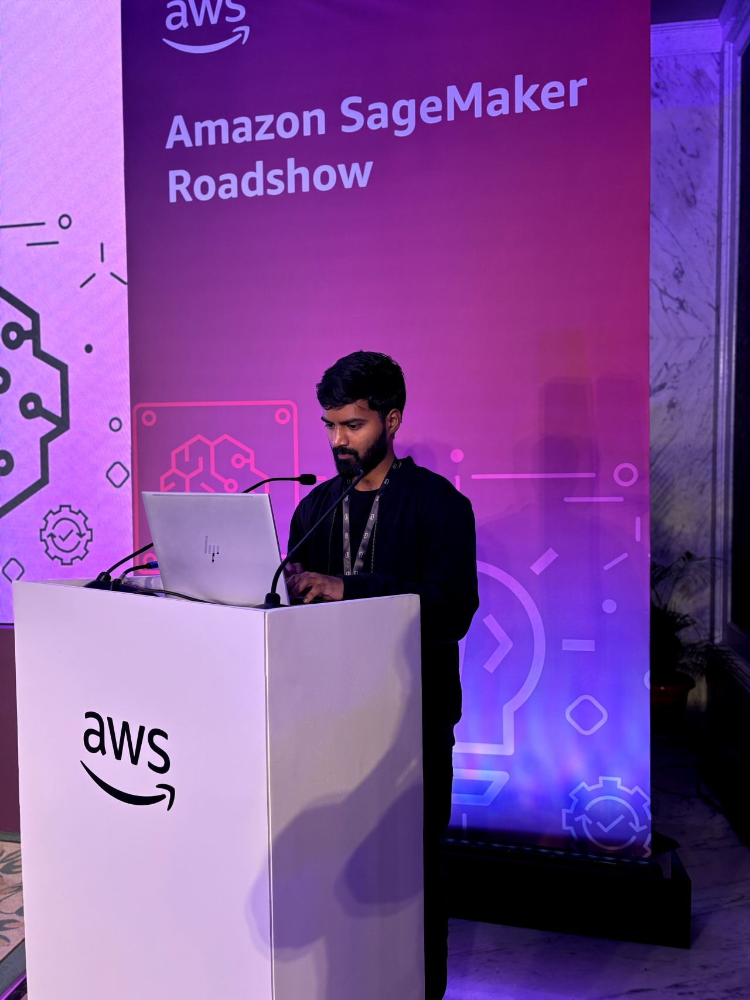

# 📅 Day 1: The Spark That Started Everything

## 🚀 AWS SageMaker Roadshow Adventure

Today was **INCREDIBLE**! Attended the AWS Agentic AI & SageMaker Roadshow and it completely changed my perspective on what I want to achieve.

*The AWS Agentic AI & SageMaker Roadshow - where it all began!*

### What Happened Today:

**🎯 Event Highlights:**
- Delegate badge on, laptop open, curiosity at maximum level
- Dove head-first into live labs exploring Amazon SageMaker's MLOps workflow
- Learned about the new Bedrock agents and their capabilities
- Attended breakout sessions on open-source OSS models
- Got practical tips on cost-optimized fine-tuning

*My handwritten notes during the session - capturing Apache Iceberg architecture, SageMaker data processing, and AWS analytics solutions. Old school note-taking for deep retention! 📝*

**📝 Key Technical Concepts Captured in My Notes:**

*Page 1 - Advanced Architecture:*
- **Apache Open API Iceberg**: S3 Data Lakes ↔ Amazon Redshift architecture
- **Zero ETL Integrations**: Seamless data flow strategies
- **SageMaker Data Processing**: EMR, AWS Glue, Athena, managed workflows
- **Analytics Stack**: Apache Spark, Hive, Presto, Flink, Trino integration
- **Performance Gains**: 10x throughput, 8x faster query performance with managed Iceberg tables
- **Storage Strategy**: Immutable storage patterns, no CRUD operations approach

*Page 2 - Strategic Insights & Next-Gen Vision:*
- **Keynote Theme**: "The Power of Conviction: The Future is Now" 
- **Innovation Philosophy**: "Innovation is a team sport" - Seamless teamwork + Tag teaming drives innovation
- **GenAI Comprehensive Stack**: ML Models → Analytics → Data Insights → Data Integration → Governance → Data Lakes
- **Data Challenge**: "Data is too soiled and moving it is expensive (Siloed)" - core problem statement
- **Evolution Pipeline**: Big Data Processing → SQL Analytics → Machine Learning → Generative AI
- **SageMaker Vision**: "The Next Generation" unified platform for data, analytics, and AI
- **Unified Studio**: Integrated data governance with lakehouse architecture

**🎤 Lightning Talk Achievement:**
- **Topic**: Rapid prototyping with Bedrock's Retrieval Augmented Generation (RAG) pipeline
- **Result**: Audience Q&A was 🔥 and reinforced how fast GenAI is moving from hype to reality
- **Feeling**: Proud and more confident in my ML knowledge

*Learning, networking, and sharing knowledge - the energy was incredible!*

**💡 BREAKTHROUGH MOMENT - System Design Discovery:**

During the webinar, I was asked about Uber's monthly rides in Bangalore. I approached it like an engineer-architect:

1. **Population Segmentation**: 10M population → smartphone users, active users
2. **Market Analysis**: Ride-hailing adoption rates and user behavior
3. **Market Share**: Uber's 40-45% share in Indian car segment (verified with research)
4. **Usage Patterns**: Active users average ~8 rides/month based on market data
5. **Final Calculation**: **~6.75 million rides per month** (realistic estimate)

**Key Market Insights I Discovered:**
- Uber dominates with 45% market share in cars (vs Ola's 30%, Rapido's 18%)
- 75% smartphone penetration in urban Bangalore
- 25% of smartphone users actively use ride-hailing
- India's ride-hailing market worth $8.28B (2025), growing at 12-18% CAGR

**🎉 The panel APPLAUDED my approach!** This moment made me realize I have a natural inclination for system design and data architecture. My methodology of breaking down complex problems into data-driven components resonated with the technical audience.

*Deep diving into AWS SageMaker and Bedrock - hands-on learning at its best!*

*The collaborative learning environment that sparked new ideas and connections*

## 🏠 Evening Research & Planning

Came back home energized and immediately started researching:

### The Plan Born Tonight:
- **DSA with Python**: Master data structures and algorithms using Python
- **AWS Deep Dive**: Build on today's learnings with hands-on cloud projects  
- **System Design**: Explore scalable architectures like Big Tech companies use
- **Python Mastery**: Become interview-ready with Python as my primary language

### Course Selected:
Found this perfect course to start with: [YouTube Course](https://www.youtube.com/watch?v=pkYVOmU3MgA)

*More detailed technical notes - diving deep into AWS services, architectures, and implementation details. This is how you turn events into actionable knowledge! 🧠*

*The moment of realization - from AWS learnings to Big Tech preparation plan!*

## 📂 Today's Code:
- `my_day_story.py` - A Python script that tells the story of this amazing day

## 🎯 Tomorrow's Focus:
- Start the YouTube course I found
- Begin with basic DSA concepts in Python
- Set up proper development environment
- Create a structured learning schedule

## 💭 Key Realizations:
1. **I love system design** - The Uber problem-solving approach felt natural
2. **Teaching excites me** - The lightning talk was energizing, not nerve-wracking
3. **Big Tech is achievable** - Today showed me I can think at the required level
4. **Python + AWS is my path** - Clear focus on this stack for the next 100 days

---
**Time**: 11:55 PM  
**Status**: Inspired and ready to begin the journey  
**Next**: Day 2 - Start coding and structured learning! 💤 