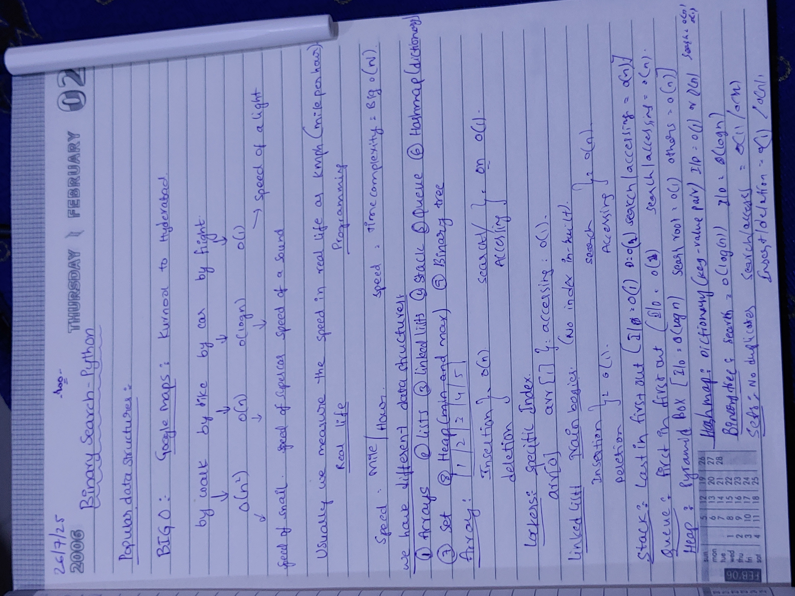

# 📅 Day 2: Data Structures & Big O Complexity

## 🎯 What I Learned
**YouTube Course**: [Data Structures and Algorithms](https://www.youtube.com/watch?v=O9v10jQkm5c)

### 🧠 Key Concepts
- **Big O Time Complexity**: O(1), O(log n), O(n), O(n log n), O(n²), O(2ⁿ)
- **Data Structures**: Arrays, Lists, Linked Lists, Stacks, Queues, Hash Maps, Sets, Heaps, Binary Trees
- **I/O Operations**: `input()`, type conversion, f-strings, error handling

*My handwritten notes on data structures and algorithms - capturing the core concepts!*

## 💻 Code Built
- **`cli_calculator.py`**: Integer calculator with +, -, *, /, % operations
- **`cli_calculator_using_float.py`**: Float calculator (in progress)

### ✅ Features Implemented
- User input with validation
- Division by zero handling  
- Clean formatted output
- Error handling for invalid inputs

## 📈 Progress
**Completed**: Big O fundamentals, data structures overview, calculator with I/O operations

---
**📅 Date**: Saturday, July 26, 2025

---

## 🚀 About Me
*Building CS fundamentals for Big Tech interviews while pursuing my passion for AI innovation!*

**Boya Uday Kumar** - AI Research Enthusiast & Developer  
💡 *"I love being an AI researcher and believe in the power of continuous learning to transform ideas into reality"*

🔗 **Connect with me:**  
📱 [Portfolio](https://ud-ai-kumar.vercel.app/) | 💼 [LinkedIn](https://www.linkedin.com/in/uday-kumar-boya-ai-innovator)

*Every line of code is a step closer to innovation! 🌟* 